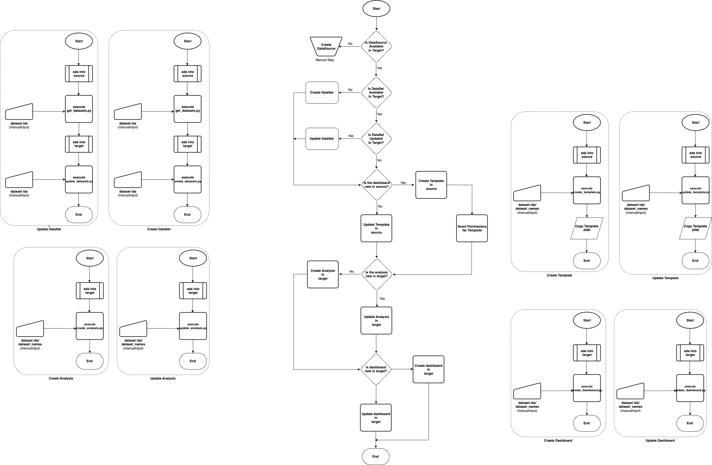

# AWSQuickSightMigrationHelper
A collection of scripts to enable faster QuickSight Migrations

## Introduction
AWS QuickSight is a cloud-based business intelligence (BI) tool that lets users explore data, create reports, and gain insights. Compared to traditional BI tools, QuickSight offers easier integration with other AWS services, faster deployment, and built-in AI/ML capabilities. However, migrating dashboards between accounts in QuickSight requires scripting or APIs, unlike the simpler promotion features in other tools. This guide simplifies the process of programmatically migrating QuickSight objects (like dashboards) from a development (dev) environment to a production (prod) environment.

> [!TIP]  
> Please read this document thoroughly before using the scripts. Additionally, be sure to read the documentation within the Python scripts.  

## Migrating QuickSight dashboards

### Overall Process Flow



## Detailed Process
The main process flow for the migration is as shown below.


The above figure depicts a high-level process for creating and updating dashboards in Amazon QuickSight. It involves several steps that determine how the data source is prepared and incorporated into the final dashboard. Let's break it down:

1. **Start**: The process begins here.
2. **DataSource availability check**: `Where? Target Account`  
Here you should determine, whether a new DataSource needs to be created for the dashboard. If the DataSource exists, you should proceed to the next step. If the DataSource does not exist, you should proceed with DataSource creation.

3. **DataSet status check**: `Where? Target Account`  
This is the step to check if the dataset (presumably derived from the data source) already exists in the target environment.
- If the dataset is present, then check if the dataset needs updation.
    - Proceed after updating the dataset.
- If the dataset isn't available, then the dataset has to be created in the target account.

    >Refer section *Creating and Updating DataSets* for more details.

4. **Template status check**: `Where? Source Account`  
This is the step to check if the template (blueprint of a dashboard), is available in the *source account*.
- If the template already exists, create a new version of the template, and note down the ARN.
- If the template does not exist, then a new template has to be created, and the ARN has to be noted down as well.

    >Refer section *Creating and Updating Templates* for more details.

5. **Grant Permissions for Template**: `Where? Source Account`

If a new template is created, the required permissions must be granted to the target account so it can access the template.

6. **Analysis Operations**:  `Where? Target Account`

At this juncture check if the analysis is already available on the target account.
- If the analysis exists update the analysis to the latest version using the template ARN from step 4.
- If the analysis doesn't exist, create a new analysis pointing to the latest template from step 4.

    >Refer section *Creating and Updating Analyses* for more details.

7. **Dashboard Operations**: `Where? Target Account` 

Similar to step 6, this step checks if the dashboard exists in the target environment.
- If the dashboard exists, update the dashboard using the ARN of the analysis from step 6
- If the dashboard doesn't exist, publish the dashboard using the ARN of the analysis from step 6

    >Refer section Creating and Updating Dashboards for more details.

8. End: This signifies the completion of the process.

Overall, this flowchart outlines a process for creating and updating dashboards in Amazon QuickSight. It considers data source creation, dataset management, template updates, controlling access through permissions, and creation and updation of analyses and dashboards.

> [!IMPORTANT]  
> ### Pre-requisites before proceeding into the next section 
> 1. A mechanism to get AWS credentials from both accounts, automation/manual. 
> 2. python3 and pip are available in your laptop.  
> 3. boto3 is installed using pip command  
> 4. Clone this repo into your laptop.  
> 5. aws-cli is installed and callable.  
> 6. A posix compatible cli.

## Creating and Updating DataSets
The process flow for creating and/or updating datasets is shown below.  


We proceed on the assumption that the target account has a pre-existing data source.
### Get DataSets

`Where? Source Account`

1. Note down all the dataset IDs that need to be migrated to the target account. You can find these details by referring to the analyses in the source account, either through the console or by using our script.
2. Ensure account credentials are available at `~/.aws/credentials` file.
3. Open the file get_data_sets.py, checked out on your workstation.
4. Pass the required inputs as mentioned in the script documentation.
5. Execute the script.
6. The script creates a folder named qs_extracts and dumps files into it. These files are crucial for migrating datasets

### Create DataSets
`Where? Target Account`

1. Note down all the dataset IDs that need to be created in the target account. You can find these details by referring to the analyses in the source account, either through the console or by using our script.

    > This can be the same list as in Get DataSets section, or a subset.

2. Ensure account credentials are available at `~/.aws/credentials` file.
3. Open the file create_data_sets.py, checked out on your workstation.
4. Pass the required inputs as mentioned in the script documentation.
5. Execute the script.

> [!CAUTION]  
> Be mindful of errors during the process. If a dataset already exists in the target account, it will be updated, not recreated.

### Update DataSets
`Where? Target Account`

1. Note down all the dataset IDs that need to be updated in the target account. You can find these details by referring to the analyses in the source account, either through the console or by using our script.

    > This can be the same list as in Get DataSets section, or a subset.

2. Ensure account credentials are available at `~/.aws/credentials` file.
3. Open the file update_data_sets.py, checked out on your workstation.
4. Pass the required inputs as mentioned in the script documentation.
5. Execute the script.

> [!CAUTION]  
> Be mindful of errors during the process. If a dataset doesn't exist in the target account, it should be created before being updated.

### Creating and Updating Templates


#### Creating a template

`Where? Source Account`

1. Note down the analysis ID that needs to be replicated in the target account.
2. Ensure account credentials are available at `~/.aws/credentials` file.
3. Open the file create_template.py, checked out on your workstation.
4. Pass the required inputs as mentioned in the script documentation.
5. Execute the script.

> [!TIP]  
> Upon successful execution, note the ARN of the template, this will be needed in the subsequent steps.

> [!IMPORTANT]  
> ### Post creation steps:  
> Ensure template is in CREATION_SUCCESSFUL state.  
> ```sh
> aws quicksight describe-template --aws-account-id source_account_id --template-id "your_template_id"  
> ```
> Prepare a json file TemplatePermissions.json in the root of the current directory, with permissions for the template. Content as below.  
>    
> ```json
> [  
>    {  
>       "Principal": "arn:aws:iam::target_account_id:root",  
>       "Actions": [
>           "quicksight:UpdateTemplatePermissions",
>           "quicksight:DescribeTemplate"
>       ]  
>    }  
> ] 
> ```     
> Grant permissions to the template.  
>        
> ```sh
> aws quicksight update-template-permissions --aws-account-id source_account_id --template-id "your_template_id" --grant-permissions file://./TemplatePermissions.json --region region_name
> ```

#### Updating a template

`Where? Source Account`

1. Note down the analysis ID that needs to be replicated in the target account.
2. Ensure account credentials are available at `~/.aws/credentials` file.
3. Open the file update_template.py, checked out on your workstation.
4. Pass the required inputs as mentioned in the script documentation.
5. Execute the script.

> [!IMPORTANT]  
> Remember to update the template version by 1.


> [!NOTE]  
> Upon successful execution, note the ARN of the template, this will be needed in the subsequent steps. 

### Creating and Updating Analyses


#### Creating an Analysis

`Where? Target Account`

1. Note down the dataset IDs and dataset names, belonging to the analysis that needs to be replicated in the target account.
2. Ensure account credentials are available at `~/.aws/credentials` file.
3. Open the file create_analysis.py, checked out on your workstation.
4. Pass the required inputs as mentioned in the script documentation.
5. Execute the script.


> [!NOTE]  
> Upon successful execution, note the ARN of the analysis, this will be needed in the subsequent steps.

#### Updating an Analysis

`Where? Target Account`

1. Note down the dataset IDs and dataset names, belonging to the analysis that needs to be replicated in the target account.
2. Ensure account credentials are available at `~/.aws/credentials` file.
3. Open the file update_analysis.py, checked out on your workstation.
4. Pass the required inputs as mentioned in the script documentation.
5. Execute the script.

> [!NOTE]  
> Upon successful execution, note the ARN of the analysis, this will be needed in the subsequent steps.

### Creating and Updating Dashboards


#### Creating a Dashboard

`Where? Target Account`

1. Note down the dataset IDs and dataset names, belonging to the analysis that needs to be replicated in the target account.
2. Ensure account credentials are available at `~/.aws/credentials` file.
3. Open the file create_dashboard.py, checked out on your workstation.
4. Pass the required inputs as mentioned in the script documentation.
5. Execute the script.

#### Updating a Dashboard

`Where? Target Account`

1. Note down the dataset IDs and dataset names, belonging to the analysis that needs to be replicated in the target account.
2. Ensure account credentials are available at `~/.aws/credentials` file.
3. Open the file update_dashboard.py, checked out on your workstation.
4. Pass the required inputs as mentioned in the script documentation.
5. Execute the script.

> [!NOTE]  
> This creates a new dashboard version. Please note the same.

#### Publishing a Dashboard version

`Where? Target Account`

1. Ensure account credentials are available at `~/.aws/credentials` file.
2. Open the file publish_dashboard.py, checked out on your workstation.
3. Pass the required inputs as mentioned in the script documentation.
4. Execute the script.

> [!NOTE]  
> This will publish the dashboard to the specified version.

> [!WARNING]  
> Going to a previous version of a dashboard after the datasets have been updated, can result in inconsistent behaviour and sometimes even break the dashboard.

## References

1. https://aws.amazon.com/blogs/big-data/migrate-amazon-quicksight-across-aws-accounts/

## Questions?

Feel free to open a discussion thread. Thanks!